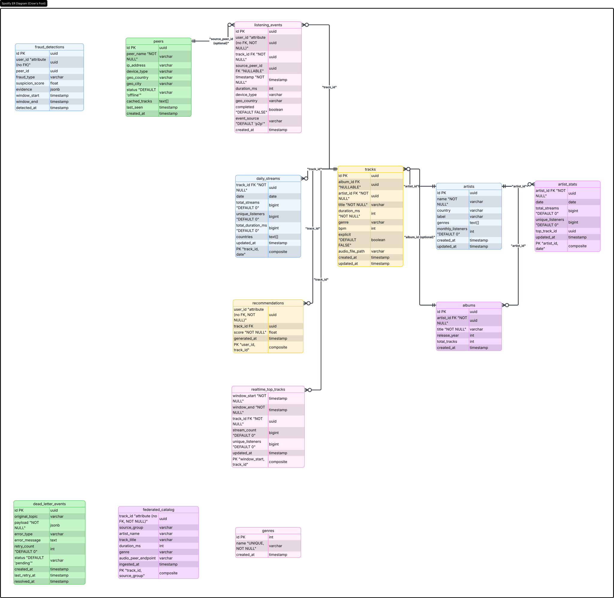

# SPOTIFY Data Pipeline

Bienvenue sur le projet final **SPOTIFY Data Pipeline**. Il s'agit d'une plateforme de traitement de données (architecture Lambda) conçue pour ingérer, transformer et analyser en temps réel et en différé des événements de streaming musical (écoute, fédération, détection de fraudes).

## 🚀 Architecture Globale

Le projet repose sur une **Architecture Lambda** complète combinant traitement batch et temps réel.



### 1. Speed Layer (Temps Réel)
Traitement continu et analytique à très faible latence :
- **Kafka** : Message broker résilient pour l'ingestion temps réel.
- **Spark Structured Streaming** : Calculs des tops (tumbling windows), détection de fraudes.
- **Redis** : Base de données in-memory pour l'affichage temps réel (Top 50, classements).

### 2. Batch Layer (Différé)
Traitement massif et consolidé pour l'historique et la recommandation :
- **Airflow** : Orchestration des DAGs de chargement du catalogue, agrégations et retraitement (DLQ).
- **MinIO (S3)** : Data Lake pour le stockage brut (Raw) et traité (Parquet).
- **PostgreSQL** : Data Warehouse pour les agrégats de référence et les jointures.

## 🛠️ Stack Technique

- **Orchestration** : Apache Airflow 2.9 (CeleryExecutor)
- **Streaming & Data Processing** : Apache Spark 3.5, Apache Kafka 7.6 (KRaft)
- **Bases de données** : PostgreSQL 15, Redis 7
- **Stockage Objet** : MinIO (compatible S3)
- **Conteneurisation** : Docker & Docker Compose
- **Tests & Qualité** : Pytest, Flake8, JSON Schema

## 📂 Structure du projet

- `dags/` : Pipelines batch Airflow (Ingestion, Agrégation, Réconciliation, DLQ).
- `spark_jobs/` : Jobs temps réel Spark (Tendances, Fraude, Enrichissement).
- `src/` : Modules Python de simulation et de transformation de données.
- `sql/` : Scripts de création de la base et du modèle de données (Data Warehouse).
- `contracts/` : Schémas JSON pour la fédération inter-groupes.
- `docs/` : RUNBOOK, Documentation et guide méthodologique.
- `tests/` : Tests unitaires et d'intégration.
- `docker-compose.yml` : Infrastructure complète en code.

## ⚙️ Démarrage Rapide

1. **Lancer l'infrastructure complète** :
   ```bash
   docker compose up -d
   ```
2. **Accès aux interfaces** :
   - Airflow : [http://localhost:8080](http://localhost:8080) (admin / admin)
   - MinIO : [http://localhost:9001](http://localhost:9001) (minioadmin / minioadmin)
   - Kafka UI : [http://localhost:8090](http://localhost:8090)

3. **Générer des données de test** :
   ```bash
   python -m src.data_generator.generate_catalog
   ```

4. **Lancer le simulateur P2P** :
   ```bash
   python -m src.p2p_simulator.simulator
   ```

## ✅ Résilience & Qualité

Le système est conçu pour tolérer les pannes :
- **Dead Letter Queue (DLQ)** : Redirection et retraitement asynchrone des données corrompues.
- **Watermarking Kafka/Spark** : Gestion avancée des retards (*late events*).
- **Chaos Engineering testé** : Survie à la perte de brokers Kafka, workers Spark ou coupure DB.
