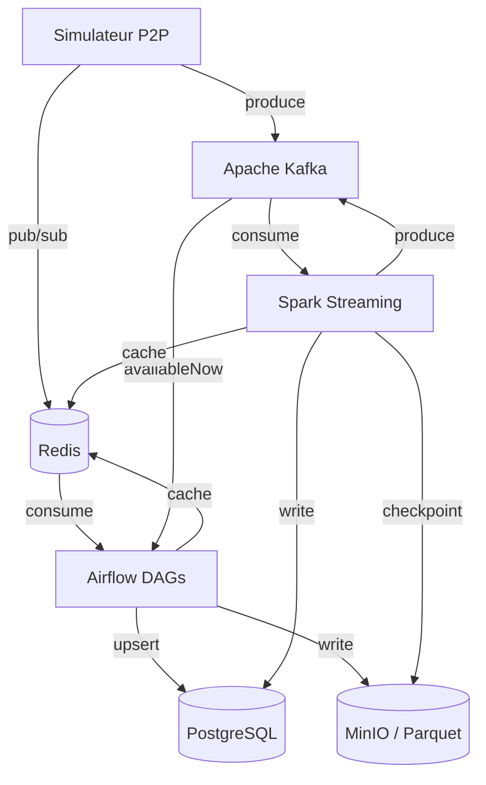

# Architecture SPOTIFY

> **À compléter par votre groupe** — Ce document doit décrire VOTRE architecture, pas celle de référence.

---

## Vision d'ensemble

```
[Insérer ici votre diagramme d'architecture]
Outil recommandé : draw.io, Excalidraw, ou Mermaid (ci-dessous)
```



---

## Décisions architecturales

### ETL vs ELT — Mapping par pipeline

Rappel : **ETL** = transformer *avant* de charger dans la destination (la donnée arrive déjà propre). **ELT** = charger d'abord la donnée brute dans la destination, puis transformer *à l'intérieur* de celle-ci (souvent en SQL). Choix par pipeline ci-dessous, justifié à partir du code des DAGs (`dags/*.py`) et du job Spark.

| Pipeline | Approche | Justification |
|----------|----------|---------------|
| `catalog_ingestion` | **ETL** | Flux du DAG : `extract_from_minio → validate_schema → transform_catalog (normalisation, dédoublonnage) → load_to_postgres (upsert ON CONFLICT)`. La normalisation et la déduplication des artistes se font **en mémoire, avant** l'écriture. Le catalogue de référence (`artists`/`albums`/`tracks`) ne doit contenir ni doublon ni nom incohérent : la donnée doit être propre au moment où elle entre. Transformer avant le chargement (ETL) est le bon choix. |
| `streaming_events` | **ETL** (hybride léger) | Flux : `consume_from_redis → validate_events (invalides → DLQ) → enrich_events (jointure catalogue) → store_to_parquet (MinIO) + upsert_to_postgres`. Validation et enrichissement (track_id → artiste/genre) se font **dans le worker avant** l'écriture, et les événements défectueux partent en DLQ avant de polluer la table. ETL en micro-batch (5 min). Nuance : l'écriture Parquet brute sur MinIO sert aussi de **landing zone** réutilisable, ce qui ouvre la porte à de l'ELT en aval. |
| `aggregation` | **ELT** | Les données sont déjà chargées dans PostgreSQL (`listening_events`) par le pipeline précédent. `aggregation` recalcule les agrégats **directement en SQL dans la base** (`compute_top_tracks`, `compute_artist_stats`, `compute_p2p_metrics` → `daily_streams`, `artist_stats`). Transformation *après* chargement et *dans* la destination = schéma ELT typique. On exploite la puissance d'agrégation de PostgreSQL (GROUP BY, index horaire) sans réextraire la donnée. |
| `streaming_trends` (Spark) | **ETL** (streaming) | Spark Structured Streaming lit le flux, calcule les comptes par fenêtre de 5 min (agrégation **dans le moteur Spark**) puis écrit le résultat déjà transformé dans `realtime_top_tracks`. La transformation précède le chargement → ETL appliqué en continu. En couche speed, l'agrégat fenêtré doit être produit *avant* de servir la table temps réel : on ne peut pas attendre un recalcul SQL a posteriori. |

**Lecture transversale :** le socle batch mélange volontairement les deux styles. **ETL en entrée** (catalogue et événements, où la qualité avant écriture est critique et où la DLQ filtre le bruit) et **ELT pour les agrégats** (donnée propre déjà dans PostgreSQL, SQL = l'outil le plus efficace pour agréger). La couche speed (Spark) reste en ETL streaming car la transformation fenêtrée est indissociable de la production du résultat.

### Partitionnement Parquet

Expliquer ici votre stratégie de partitionnement des fichiers Parquet sur MinIO.

```
spotify-parquet/
└── listening_events/
    └── date=2025-01-15/
        └── hour=14/
            └── part-00000.parquet
```

**Pourquoi cette structure ?**
→ À compléter

### Topics Kafka — Stratégie de partitionnement

| Topic | Partitions | Clé | Justification |
|-------|-----------|-----|---------------|
| listening_events | 6 | user_id | ... |
| p2p_network_events | 6 | peer_id | ... |
| catalog_updates | 3 | track_id | ... |
| fraud_alerts | 3 | user_id | ... |

**Pourquoi `user_id` comme clé pour `listening_events` ?**
→ À compléter

---

## Choix techniques

### Pourquoi CeleryExecutor (pas KubernetesExecutor) ?

→ À compléter

### Gestion des secrets

→ Comment votre groupe gère les credentials (PostgreSQL password, MinIO keys...) ?

---

## Architecture Lambda — Batch + Speed Layer

```
Speed layer  : Simulateur → Kafka → Spark → PostgreSQL (realtime_*) + Redis
Batch layer  : Simulateur → Kafka (availableNow) → Airflow → PostgreSQL (daily_*) + MinIO
Serving layer: PostgreSQL + Redis ← consommé par les clients
```

**Ce qui est en batch et pourquoi :**
→ À compléter

**Ce qui est en streaming et pourquoi :**
→ À compléter

---

## Schémas d'événements

### listening_event

```json
{
  "event_id":    "uuid",
  "user_id":     "uuid",
  "track_id":    "uuid",
  "source_peer": "uuid",
  "timestamp":   "2025-01-15T14:30:00Z",
  "duration_ms": 45000,
  "device_type": "mobile",
  "geo_country": "FR",
  "completed":   true,
  "event_source": "p2p"
}
```

### p2p_network_event

```json
{
  "event_id":   "uuid",
  "event_type": "chunk_transfer",
  "peer_id":    "uuid",
  "target_peer": "uuid",
  "track_id":   "uuid",
  "chunk_size_bytes": 65536,
  "latency_ms": 12,
  "timestamp":  "2025-01-15T14:30:01Z"
}
```

---

## Leçons apprises

> À compléter au fur et à mesure de la semaine.

- **Lundi** : ...
- **Mardi** : ...
- **Mercredi** : ...
- **Jeudi** : ...
- **Vendredi** : ...
