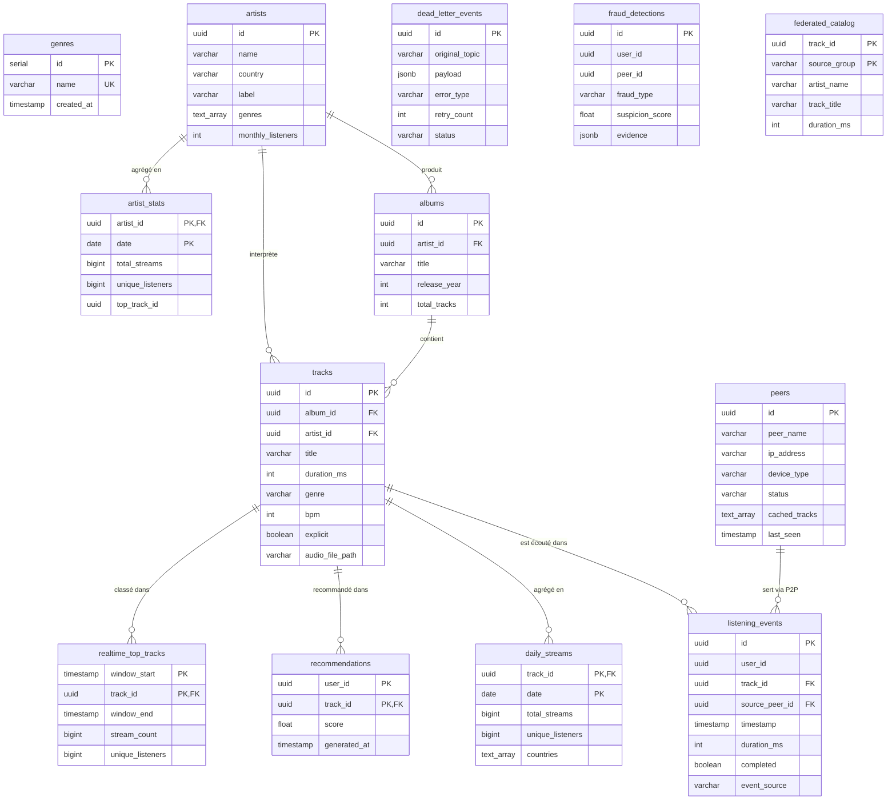

# Modèle de données SPOTIFY

> Source de vérité : [`sql/init_spotify_db.sql`](../sql/init_spotify_db.sql)
> Base PostgreSQL 15+ — utilisateur et base `spotify`.

---

## 1. Inventaire des tables et index

13 tables, réparties en 4 modules. Vérifié par parsing de `init_spotify_db.sql`.

| Module | Table | Clé primaire | Clés étrangères | Index explicites |
|--------|-------|--------------|-----------------|------------------|
| 1 — Catalogue | `genres` | `id` (SERIAL) | — | `UNIQUE(name)` |
| 1 — Catalogue | `artists` | `id` (UUID) | — | `UNIQUE(name, label)` |
| 1 — Catalogue | `albums` | `id` (UUID) | `artist_id → artists` | — |
| 1 — Catalogue | `tracks` | `id` (UUID) | `album_id → albums`, `artist_id → artists` | — |
| 1 — Réseau P2P | `peers` | `id` (UUID) | — | — |
| 1 — Événements | `listening_events` | `id` (UUID) | `track_id → tracks`, `source_peer_id → peers` | `user_id`, `track_id`, `timestamp`, `date_trunc('hour', timestamp)` |
| 1 — Agrégats | `daily_streams` | `(track_id, date)` | `track_id → tracks` | (PK composite) |
| 1 — Agrégats | `artist_stats` | `(artist_id, date)` | `artist_id → artists` | (PK composite) |
| 1 — Agrégats | `recommendations` | `(user_id, track_id)` | `track_id → tracks` | (PK composite) |
| 1 — DLQ | `dead_letter_events` | `id` (UUID) | — | `status`, `created_at` |
| 2 — Temps réel | `realtime_top_tracks` | `(window_start, track_id)` | `track_id → tracks` | (PK composite) |
| 2 — Temps réel | `fraud_detections` | `id` (UUID) | — | — |
| 3 — Inter-groupes | `federated_catalog` | `(track_id, source_group)` | — | (PK composite) |

**Index explicites créés (`CREATE INDEX`) :**

| Index | Table | Colonne(s) |
|-------|-------|-----------|
| `idx_listening_events_user_id` | `listening_events` | `user_id` |
| `idx_listening_events_track_id` | `listening_events` | `track_id` |
| `idx_listening_events_timestamp` | `listening_events` | `timestamp` |
| `idx_listening_events_ts_partition` | `listening_events` | `date_trunc('hour', timestamp)` |
| `idx_dlq_status` | `dead_letter_events` | `status` |
| `idx_dlq_created_at` | `dead_letter_events` | `created_at` |

> **Note de vérification** — La validité du DDL et la création effective des tables/index se constatent sur la stack lancée (issue #1) :
> ```sql
> \dt                              -- liste les 13 tables
> \di                              -- liste les index (explicites + index implicites des PK/UNIQUE)
> \d listening_events              -- détaille colonnes + 4 index de la table
> ```
> Chaque clé primaire et chaque contrainte `UNIQUE` génère automatiquement son propre index B-tree, en plus des 6 index `CREATE INDEX` ci-dessus.

---

## 2. Diagramme ERD



> Le diagramme rend directement sur GitHub (Mermaid natif). Une version éditable peut être recréée sur [dbdiagram.io](https://dbdiagram.io) à partir de la même structure si une image PNG est exigée.
>
> `user_id` (dans `listening_events`, `recommendations`, `fraud_detections`) n'est **pas** une clé étrangère : il n'existe pas de table `users`. Les utilisateurs ne sont identifiés que par leur UUID dans les événements — choix volontaire pour rester proche d'un flux d'événements brut.

---

## 3. Réponses aux questions

### Pourquoi `listening_events` est indexé sur `(timestamp)` ET `date_trunc('hour', timestamp)` ?

Les deux index servent deux familles de requêtes différentes et ne sont pas redondants.

L'index sur `timestamp` (B-tree brut) accélère les requêtes par **plage de temps fine** et les tris chronologiques : `WHERE timestamp BETWEEN ... AND ...`, `ORDER BY timestamp`, fenêtres glissantes, récupération des derniers événements. C'est l'accès « ligne de temps continue ».

L'index sur l'expression `date_trunc('hour', timestamp)` est un **index fonctionnel**. Il pré-calcule le bucket horaire de chaque ligne. Sans lui, une requête comme `GROUP BY date_trunc('hour', timestamp)` devrait recalculer la troncature sur chaque ligne et ne pourrait pas s'appuyer sur l'index `timestamp` (PostgreSQL n'utilise pas un index brut pour une expression dérivée). Il rend efficaces les agrégations horaires du `aggregation_pipeline` et l'écriture Parquet partitionnée par heure (`store_to_parquet` → `date=.../hour=...`), qui regroupent les événements par tranche d'une heure.

En résumé : `timestamp` pour le **filtrage/tri continu**, `date_trunc('hour', ...)` pour le **bucketing/agrégation discret par heure**. Garder les deux évite de choisir entre requêtes ad hoc rapides et agrégats batch rapides.

### Quelle est la différence entre `daily_streams` (batch) et `realtime_top_tracks` (Spark) ?

Les deux tables comptent des streams par morceau, mais elles appartiennent à deux couches distinctes de l'architecture Lambda et n'ont ni la même granularité, ni la même fraîcheur, ni le même producteur.

`daily_streams` est la **couche batch**. Sa clé est `(track_id, date)` : une ligne = le total d'un morceau pour une journée entière. Elle est alimentée une fois par jour par `aggregation_pipeline` (Airflow), à partir des `listening_events` consolidés. Elle vise l'**exactitude et l'exhaustivité** (tous les événements de la journée, y compris les retardataires), au prix de la latence (résultats disponibles le lendemain). Elle stocke des agrégats riches : `total_streams`, `unique_listeners`, `total_duration_ms`, `countries`. C'est la source de vérité historique.

`realtime_top_tracks` est la **couche speed**. Sa clé est `(window_start, track_id)` : une ligne = le compte d'un morceau sur une **fenêtre temporelle courte** (5 minutes, alimentée par `streaming_trends_job` en Spark Structured Streaming, comme l'indique le `COMMENT ON TABLE`). Elle vise la **fraîcheur** (mise à jour en quelques secondes) plutôt que l'exhaustivité parfaite : elle peut être approximative à cause des late events. Elle sert le « top tracks live » et est régulièrement écrasée/recalculée par fenêtre.

En une phrase : `daily_streams` répond à « combien de streams hier au total, exactement ? » (batch, lent, exact, par jour) ; `realtime_top_tracks` répond à « qu'est-ce qui cartonne en ce moment ? » (streaming, rapide, approché, par fenêtre de 5 min).

### Pourquoi `dead_letter_events.payload` est `JSONB` plutôt que `TEXT` ?

Le `payload` contient l'événement défectueux d'origine, qui est un document JSON de structure variable (un `listening_event`, un `p2p_network_event`, un message Kafka brut…). Trois raisons motivent `JSONB` :

1. **Interrogeabilité structurée.** `JSONB` permet de filtrer et d'indexer le contenu : `WHERE payload->>'track_id' = '...'`, `payload @> '{"event_source":"p2p"}'`, et des index GIN si besoin. En `TEXT`, le payload serait une chaîne opaque qu'il faudrait parser applicativement à chaque inspection — impossible de requêter dessus en SQL pour l'audit ou le tri par cause.

2. **Validation et intégrité.** `JSONB` rejette à l'insertion tout JSON syntaxiquement invalide, ce qui garantit qu'un payload stocké est réellement du JSON exploitable par le `dlq_reprocessing_pipeline` qui doit le re-parser et le réinjecter. `TEXT` accepterait n'importe quoi.

3. **Efficacité au retraitement.** `JSONB` est stocké sous forme binaire décomposée : pas besoin de re-parser le texte à chaque lecture, accès direct aux clés, et déduplication des clés. Pour une DLQ relue en boucle par un pipeline horaire, c'est l'accès aux champs qui prime sur la fidélité au texte d'origine.

Le compromis assumé : `JSONB` ne conserve pas la mise en forme exacte (espaces, ordre des clés) du message original. Pour une DLQ d'audit/retraitement, c'est sans importance — on veut manipuler la donnée, pas archiver la chaîne brute octet pour octet. Si l'on tenait à la fidélité littérale, on conserverait `TEXT` ; ici l'usage (requêter, valider, réinjecter) tranche clairement pour `JSONB`.
