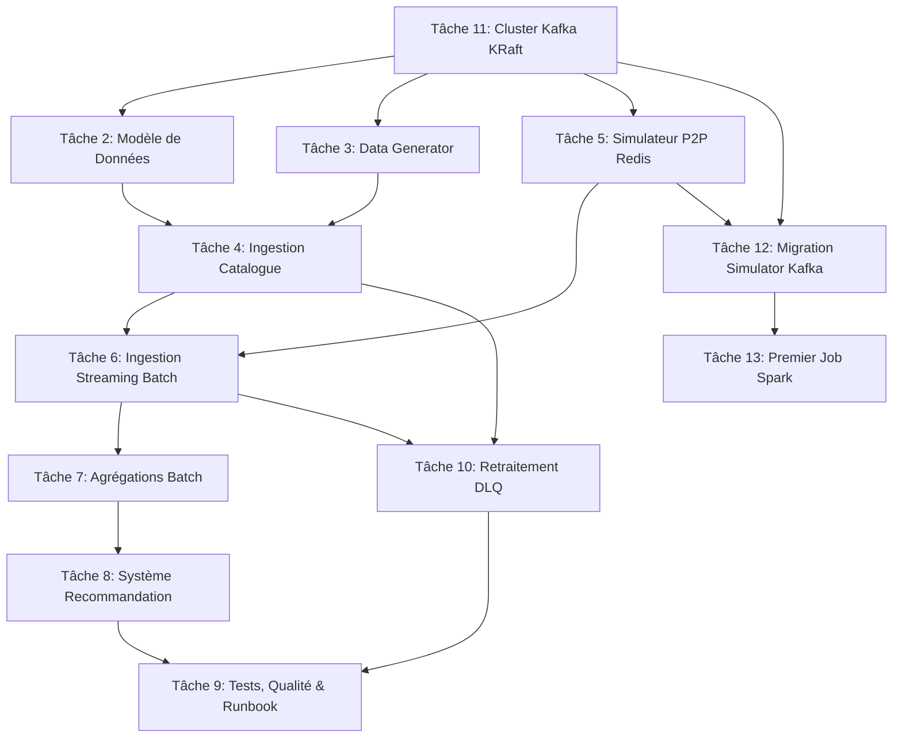

# Validation et Suivi des Tâches — Projet Data Pipeline Spotify

Ce document répertorie et explique les **13 tâches** définies sur GitHub pour le projet. Il présente leur but, leur enchaînement logique, leurs objectifs métier, les rôles des technologies utilisées et les procédures précises permettant de valider que chaque étape est pleinement fonctionnelle.

---

## 📊 Tableau Récapitulatif des Tâches

| # | Titre de la Tâche | Statut | Composant Principal | Type de Validation |
|---|---|---|---|---|
| **#1** | [Setup Docker Compose et vérification de la stack](#task-1) | **Terminé** | Infrastructure Docker | `docker compose ps` & MinIO/Airflow UI |
| **#2** | [Schéma PostgreSQL et modèle de données](#task-2) | **Terminé** | Modélisation SQL / Docs | `docs/DATA_MODEL.md` |
| **#3** | [Data Generator : catalogue musical avec Faker](#task-3) | **Terminé** | Python Generator & MinIO | Tests Unitaires & inspect MinIO |
| **#4** | [DAG `catalog_ingestion_pipeline`](#task-4) | **Terminé** | Airflow DAG | Tests Structurels & Airflow Run |
| **#5** | [Simulateur P2P : compléter et lancer](#task-5) | **Terminé** | Python Simulator / Redis | `redis-cli subscribe` |
| **#6** | [DAG `streaming_events_pipeline`](#task-6) | **Terminé** | Airflow DAG | MinIO Parquet & DB Check |
| **#7** | [DAG `aggregation_pipeline` + stockage MinIO](#task-7) | **Terminé** | Airflow DAG / ELT | Tests Structurels & SQL Check |
| **#8** | [DAG `recommendation_pipeline`](#task-8) | **Terminé** | Airflow DAG / Collaborative Filtering | Redis & PostgreSQL check |
| **#9** | [Tests pytest + README + `doc_md`](#task-9) | **Terminé** | Tests / Documentation | `pytest tests/ -v` |
| **#10** | [DAG `dlq_reprocessing_pipeline`](#task-10) | **Terminé** | Airflow DAG / Résilience | Injection SQL & State Transition |
| **#11** | [Cluster Kafka KRaft dans docker-compose](#task-11) | **Terminé** | Infrastructure Kafka | Kafka UI & Topic Listing |
| **#12** | [Migration simulateur P2P vers Kafka](#task-12) | **Terminé** | Python Simulator / Kafka | Kafka UI Flow & Redis Sync |
| **#13** | [Premier job Spark : lecture topics, affichage console](#task-13) | **Terminé** | Spark Structured Streaming | Spark Logs Check |

---

## 🔄 Enchaînement et Dépendances Logiques

Le graphe de dépendance ci-dessous montre la suite logique des tâches du projet :



---

## 🔍 Détail de Chaque Tâche et Procédure de Validation

<a id="task-1"></a>
### #1 — Setup Docker Compose et vérification de la stack
* **But de la tâche** : Mettre en place et lancer l'ensemble des conteneurs de la stack (PostgreSQL, Redis, MinIO, Airflow) et s'assurer que les services communiquent correctement.
* **Objectif métier** : Disposer d'un environnement de développement reproductible qui simule fidèlement la production pour que les ingénieurs de la plateforme puissent intégrer et tester le pipeline de bout en bout sans friction.
* **Rôle de la technologie / de l'outil** : **Docker Compose** orchestre et isole les services (base relationnelle, cache, stockage d'objets, planificateur de tâches) dans un réseau virtuel unique, évitant ainsi les conflits d'installation sur la machine hôte.
* **Fichiers concernés** : [docker-compose.yml](file:///Users/ghilesmekdam/Projets/Data_Pipeline/docker-compose.yml), [sql/init_spotify_db.sql](file:///Users/ghilesmekdam/Projets/Data_Pipeline/sql/init_spotify_db.sql)
* **Suite logique** : C'est la fondation indispensable sur laquelle reposent toutes les autres tâches.
* **Procédure de validation** :
  1. Lancer la stack :
     ```bash
     docker compose up -d
     ```
  2. Confirmer que tous les services sont actifs et sains :
     ```bash
     docker compose ps
     ```
  3. Vérifier que la base de données `spotify` est accessible et initialisée :
     ```bash
     docker compose exec postgres psql -U airflow -d spotify -c "\dt"
     ```
  4. Valider l'accès aux interfaces web :
     * Airflow UI : `http://localhost:8080` (Identifiants : `admin` / `admin`)
     * MinIO Console : `http://localhost:9001` (Identifiants : `minioadmin` / `minioadmin`)

---

<a id="task-2"></a>
### #2 — Schéma PostgreSQL et modèle de données SPOTIFY
* **But de la tâche** : Concevoir, implémenter et documenter le schéma relationnel de la base de données (13 tables, index optimisés, clés primaires et contraintes d'unicité) et définir l'approche d'ingestion (ETL ou ELT) de chaque pipeline.
* **Objectif métier** : Garantir la cohérence, la durabilité et l'intégrité du patrimoine informationnel musical (catalogue et écoutes). Modéliser les données pour supporter à la fois des requêtes analytiques journalières (historique) et des agrégations temps réel (dashboarding) tout en optimisant la performance.
* **Rôle de la technologie / de l'outil** : **PostgreSQL** sert de base relationnelle principale (source de vérité). Les index B-tree et fonctionnels accélèrent les recherches temporelles complexes, tandis que **Mermaid** permet de documenter et de visualiser graphiquement les relations (tables, clés) directement dans le dépôt de code Git.
* **Fichiers concernés** : [sql/init_spotify_db.sql](file:///Users/ghilesmekdam/Projets/Data_Pipeline/sql/init_spotify_db.sql), [docs/DATA_MODEL.md](file:///Users/ghilesmekdam/Projets/Data_Pipeline/docs/DATA_MODEL.md), [docs/ARCHITECTURE.md](file:///Users/ghilesmekdam/Projets/Data_Pipeline/docs/ARCHITECTURE.md)
* **Suite logique** : Fait suite au démarrage de la base PostgreSQL (#1). Il fournit le contrat d'écriture pour les futurs DAGs.
* **Procédure de validation** :
  1. Lire `docs/DATA_MODEL.md` et vérifier les explications sur :
     * Le double index sur `listening_events` (B-tree sur `timestamp` + index fonctionnel sur `date_trunc('hour', timestamp)`).
     * La différence de granularité et d'usage entre `daily_streams` et `realtime_top_tracks`.
     * Le choix de stocker le payload de la DLQ en type `JSONB` pour pouvoir l'interroger structurellement.
  2. Lire `docs/ARCHITECTURE.md` et confirmer la justification du choix ETL (pour `catalog_ingestion` et `streaming_events` afin de nettoyer la donnée avant insertion) et ELT (pour `aggregation` afin d'effectuer les calculs lourds directement dans la base).

---

<a id="task-3"></a>
### #3 — Data Generator : catalogue musical avec Faker
* **But de la tâche** : Générer de faux catalogues musicaux (artistes, albums, morceaux) sous forme de JSON pour 3 labels fictifs et les charger dans le bucket MinIO d'entrée.
* **Objectif métier** : Générer des jeux de données d'essais volumineux, réalistes et diversifiés (métadonnées d'artistes, albums et morceaux) afin de simuler l'intégration de nouveaux labels musicaux sans manipuler de vraies données utilisateurs.
* **Rôle de la technologie / de l'outil** : **Python** (avec la bibliothèque **Faker**) génère les données textuelles cohérentes (noms, pays, genres). Le SDK **boto3** permet d'interagir par API avec **MinIO** (un stockage d'objets compatible Amazon S3) pour y déposer les catalogues bruts en format JSON comme le ferait un flux d'ingestion réel.
* **Fichiers concernés** : [src/data_generator/generate_catalog.py](file:///Users/ghilesmekdam/Projets/Data_Pipeline/src/data_generator/generate_catalog.py), [src/data_generator/upload_to_minio.py](file:///Users/ghilesmekdam/Projets/Data_Pipeline/src/data_generator/upload_to_minio.py)
* **Suite logique** : S'appuie sur la stack MinIO (#1) et prépare les données sources requises par le premier DAG d'ingestion (#4).
* **Procédure de validation** :
  1. Exécuter le script de génération :
     ```bash
     python -m src.data_generator.generate_catalog --artists 15
     ```
     *(Génère les catalogues JSON dans `data/labels/`)*
  2. Exécuter le script d'upload :
     ```bash
     python src/data_generator/upload_to_minio.py
     ```
  3. Vérifier la présence des fichiers dans MinIO :
     ```bash
     docker compose exec minio-init mc ls local/labels-raw
     ```
     *(Doit afficher : `sunset_records.json`, `nightwave_music.json`, `urban_pulse.json`)*
  4. Lancer les tests associés :
     ```bash
     docker compose exec airflow-scheduler python -m pytest tests/unit/test_transformations.py::TestDataGenerator -v
     ```

---

<a id="task-4"></a>
### #4 — DAG `catalog_ingestion_pipeline`
* **But de la tâche** : Implémenter le premier DAG Airflow de type ETL qui extrait les catalogues des labels depuis MinIO, valide leur schéma (envoi en DLQ en cas d'erreur), applique des transformations (nettoyage des chaînes, validation des durées) et effectue un chargement idempotent (`ON CONFLICT DO UPDATE`) dans PostgreSQL.
* **Objectif métier** : Automatiser l'ingestion quotidienne des catalogues de musique des labels partenaires dans la base centrale de Spotify, en nettoyant les données en doublon ou mal formatées afin de garantir la qualité des données de référence.
* **Rôle de la technologie / de l'outil** : **Apache Airflow** orchestre et planifie le pipeline sous forme de DAG (Directed Acyclic Graph) de type ETL. Le hook de base de données **PostgresHook** permet une connexion sécurisée et idempotente avec la base relationnelle pour éviter les doublons lors des ré-exécutions (grâce au mécanisme `ON CONFLICT`).
* **Fichiers concernés** : [dags/catalog_ingestion_pipeline.py](file:///Users/ghilesmekdam/Projets/Data_Pipeline/dags/catalog_ingestion_pipeline.py)
* **Suite logique** : Dépend de la présence des fichiers générés à l'étape #3 et de la base PostgreSQL de l'étape #1.
* **Procédure de validation** :
  1. Lancer les tests structurels du DAG :
     ```bash
     docker compose exec airflow-scheduler python -m pytest tests/structure/test_dag_structure.py::TestCatalogIngestionDAG -v
     ```
  2. Déclencher manuellement le DAG `catalog_ingestion_pipeline` depuis l'interface Airflow.
  3. Vérifier les données insérées en base (ex: nombre de tracks insérées) :
     ```bash
     docker compose exec postgres psql -U spotify -d spotify -c "SELECT COUNT(*) FROM tracks;"
     ```
  4. Déclencher le DAG une seconde fois et confirmer qu'aucun doublon n'a été créé (idempotence).

---

<a id="task-5"></a>
### #5 — Simulateur P2P : compléter et lancer
* **But de la tâche** : Compléter le script de simulation réseau pour générer en continu des événements d'écoute de musique réalistes et les publier sur Redis (à la fois sur le canal Pub/Sub temps réel et dans une liste Redis persistante pour le micro-batch Airflow).
* **Objectif métier** : Simuler en continu l'activité réseau de millions d'utilisateurs écoutant de la musique en mode décentralisé peer-to-peer (P2P), afin de charger le système et de valider la réactivité de la chaîne d'ingestion temps réel.
* **Rôle de la technologie / de l'outil** : **Python** génère les événements simulés, et **Redis** (via son système Pub/Sub en mémoire) diffuse instantanément ces événements à très haute performance. Redis stocke également ces événements dans une structure de type "LIST" pour permettre une consommation par lots (micro-batching) par le scheduler de données.
* **Fichiers concernés** : [src/p2p_simulator/simulator.py](file:///Users/ghilesmekdam/Projets/Data_Pipeline/src/p2p_simulator/simulator.py)
* **Suite logique** : Complète la stack Redis (#1) et génère la source de données flux continue nécessaire pour la tâche #6.
* **Procédure de validation** :
  1. Lancer le simulateur en local ou en tâche de fond :
     ```bash
     python -m src.p2p_simulator.simulator --peers 10 --rate 3 --no-kafka
     ```
  2. Écouter le topic Redis Pub/Sub en direct depuis une autre console :
     ```bash
     docker compose exec redis redis-cli -n 1 subscribe listening_events
     ```
     *(Doit afficher les événements JSON en continu)*
  3. Inspecter la taille de la liste stockée :
     ```bash
     docker compose exec redis redis-cli -n 1 llen listening_events_list
     ```
     *(Le compteur doit s'incrémenter)*

---

<a id="task-6"></a>
### #6 — DAG `streaming_events_pipeline`
* **But de la tâche** : Créer un DAG s'exécutant toutes les 5 minutes pour vider les listes Redis (micro-batching), valider les structures (rejet en DLQ), router conditionnellement les événements (séparation entre événements d'écoute et événements réseau P2P), enrichir les écoutes avec le catalogue PostgreSQL, et sauvegarder le résultat en Parquet sur MinIO et en tables PostgreSQL.
* **Objectif métier** : Capturer, valider et enrichir le flux d'écoutes utilisateur (streams) toutes les 5 minutes pour l'archivage analytique (fichiers Parquet compressés) et le stockage opérationnel (PostgreSQL).
* **Rôle de la technologie / de l'outil** : Airflow utilise la **TaskFlow API** pour définir le flux de transformation. Les bibliothèques **pandas** et **pyarrow** structurent et compressent les données en fichiers au format colonnaire Parquet stockés de manière partitionnée chronologiquement dans MinIO. L'insertion PostgreSQL utilise des requêtes d'upsert pour garantir l'idempotence.
* **Fichiers concernés** : [dags/streaming_events_pipeline.py](file:///Users/ghilesmekdam/Projets/Data_Pipeline/dags/streaming_events_pipeline.py)
* **Suite logique** : Consomme les données générées par le simulateur P2P (#5) et s'appuie sur le catalogue inséré par le DAG d'ingestion (#4).
* **Procédure de validation** :
  1. Laisser tourner le simulateur quelques minutes pour remplir les files Redis.
  2. Déclencher ou attendre le run du DAG `streaming_events_pipeline`.
  3. Vérifier que les tables PostgreSQL se remplissent :
     ```bash
     docker compose exec postgres psql -U spotify -d spotify -c "SELECT COUNT(*) FROM listening_events;"
     ```
  4. Vérifier que les fichiers Parquet structurés sont bien écrits dans MinIO :
     ```bash
     docker compose exec minio-init mc ls -r local/spotify-parquet/
     ```
     *(Doit lister des fichiers sous `listening_events/date=.../hour=.../`)*

---

<a id="task-7"></a>
### #7 — DAG `aggregation_pipeline` + stockage MinIO
* **But de la tâche** : Calculer quotidiennement les métriques consolidées (top 50 des morceaux les plus écoutés, statistiques par artiste, taux de cache hit P2P et latence moyenne) à partir des données collectées par l'étape #6.
* **Objectif métier** : Consolider quotidiennement les données d'écoutes pour calculer les classements (Top 50 des écoutes), les statistiques des artistes, et mesurer la performance et la qualité du réseau P2P (taux d'efficacité du cache, latence).
* **Rôle de la technologie / de l'outil** : Airflow orchestre la suite logique du traitement. Les requêtes SQL analytiques de type **ELT** (Extract Load Transform) exploitent la puissance de calcul de PostgreSQL, et la bibliothèque **pandas** lit et agrège les fichiers Parquet P2P directement depuis le bucket MinIO.
* **Fichiers concernés** : [dags/aggregation_pipeline.py](file:///Users/ghilesmekdam/Projets/Data_Pipeline/dags/aggregation_pipeline.py)
* **Suite logique** : Se déclenche après la complétion de `streaming_events_pipeline` (#6) via un `ExternalTaskSensor`.
* **Procédure de validation** :
  1. Lancer les tests de structure du DAG :
     ```bash
     docker compose exec airflow-scheduler python -m pytest tests/structure/test_dag_structure.py::TestAggregationDAG -v
     ```
  2. Déclencher le DAG dans Airflow.
  3. Inspecter les tables d'agrégats :
     ```bash
     docker compose exec postgres psql -U spotify -d spotify -c "SELECT * FROM daily_streams ORDER BY total_streams DESC LIMIT 5;"
     ```
  4. Vérifier que les logs de la tâche `compute_p2p_metrics` affichent les statistiques calculées depuis les Parquet MinIO.

---

<a id="task-8"></a>
### #8 — DAG `recommendation_pipeline`
* **But de la tâche** : Mettre en œuvre un algorithme de recommandation (filtrage collaboratif basé sur la similarité cosinus) s'appuyant sur l'historique d'écoutes des 7 derniers jours et stocker le top 10 des recommandations par utilisateur dans Redis (clé temporaire de cache) et PostgreSQL.
* **Objectif métier** : Personnaliser l'expérience utilisateur en proposant un Top 10 de recommandations musicales quotidiennes, augmentant ainsi l'engagement, la fidélisation et le temps d'écoute sur la plateforme.
* **Rôle de la technologie / de l'outil** : **scikit-learn** (en Python) calcule les vecteurs de similarité cosinus entre les utilisateurs à partir de la matrice d'écoute construite avec pandas. Les résultats sont poussés dans la base PostgreSQL et dans **Redis** avec un TTL (Time To Live) de 24h pour un accès ultra-rapide par l'application client.
* **Fichiers concernés** : [dags/recommendation_pipeline.py](file:///Users/ghilesmekdam/Projets/Data_Pipeline/dags/recommendation_pipeline.py)
* **Suite logique** : Dépend de la complétion du DAG d'agrégation (#7) et de la table `listening_events` remplie à l'étape #6.
* **Procédure de validation** :
  1. Déclencher le DAG `recommendation_pipeline`.
  2. Vérifier les recommandations insérées dans PostgreSQL :
     ```bash
     docker compose exec postgres psql -U spotify -d spotify -c "SELECT * FROM recommendations LIMIT 10;"
     ```
  3. Vérifier les clés de cache dans Redis (base 1) :
     ```bash
     docker compose exec redis redis-cli -n 1 keys "reco:*"
     ```
     *(Puis exécuter `GET <clé>` pour obtenir la liste JSON des morceaux recommandés)*

---

<a id="task-9"></a>
### #9 — Tests pytest + README + `doc_md`
* **But de la tâche** : Assurer la qualité globale de la Phase 1 en validant la couverture des tests (structural + unitaire), en fournissant une documentation des DAGs dans l'UI Airflow, en mettant à jour le README avec le diagramme réel, et en rédigeant un Runbook opérationnel pour les incidents de production.
* **Objectif métier** : Limiter les régressions logicielles, assurer la maintenabilité de la base de code par l'équipe d'ingénierie et documenter les procédures de reprise sur incident pour minimiser le temps d'interruption du service (SLA).
* **Rôle de la technologie / de l'outil** : **pytest** exécute les tests unitaires et de structure automatiquement. Le format **Markdown** (`.md`) offre une documentation structurée, lisible et versionnée directement avec le code source sous Git, intégrée nativement dans l'interface web d'Airflow et de GitHub.
* **Fichiers concernés** : [README.md](file:///Users/ghilesmekdam/Projets/Data_Pipeline/README.md), [docs/RUNBOOK.md](file:///Users/ghilesmekdam/Projets/Data_Pipeline/docs/RUNBOOK.md), [tests/](file:///Users/ghilesmekdam/Projets/Data_Pipeline/tests/)
* **Suite logique** : Tâche transversale de finalisation de la Phase 1.
* **Procédure de validation** :
  1. Exécuter l'ensemble de la suite de tests :
     ```bash
     docker compose exec airflow-scheduler python -m pytest tests/ -v --tb=short
     ```
     *(Doit afficher : `34 passed, 0 failed`)*
  2. Ouvrir Airflow UI et s'assurer que chaque DAG présente une documentation détaillée en haut de sa page grâce à la propriété `doc_md`.
  3. Parcourir `docs/RUNBOOK.md` et vérifier les 3 procédures d'incidents (DAG bloqué, PostgreSQL saturé, MinIO inaccessible).

---

<a id="task-10"></a>
### #10 — DAG `dlq_reprocessing_pipeline`
* **But de la tâche** : Garantir la résilience de la plateforme en créant un pipeline horaire qui retraite les événements de la Dead Letter Queue (`dead_letter_events`). Il corrige les erreurs de timestamp manquantes (en utilisant la date d'insertion comme fallback) et incrémente le compteur de tentatives jusqu'à 3 avant d'abandonner l'événement.
* **Objectif métier** : Assurer la robustesse et la résilience de la plateforme en récupérant automatiquement les messages d'erreurs orphelins ou corrompus (par exemple en cas de décalage temporel) afin de ne perdre aucune écoute ou statistique d'activité utilisateur.
* **Rôle de la technologie / de l'outil** : La **Dead Letter Queue (DLQ)** est stockée dans une table SQL dédiée. Le DAG d'Airflow retraite périodiquement et tente d'insérer à nouveau les messages révisés, tandis que PostgreSQL garantit l'atomicité des transitions de statut (`pending` → `reprocessed` ou `abandoned`).
* **Fichiers concernés** : [dags/dlq_reprocessing_pipeline.py](file:///Users/ghilesmekdam/Projets/Data_Pipeline/dags/dlq_reprocessing_pipeline.py)
* **Suite logique** : Gère les erreurs issues de la validation du catalogue (#4) et des événements streaming (#6).
* **Procédure de validation** :
  1. Injecter un événement erroné corrigible (ex: pas de timestamp, mais track_id et user_id valides) :
     ```sql
     -- Récupérer d'abord un track_id existant
     SELECT id FROM tracks LIMIT 1;
     -- Injecter l'erreur dans la DLQ
     INSERT INTO dead_letter_events (original_topic, payload, error_type, status, retry_count)
     VALUES ('listening_events', '{"user_id": "834bf54c-8d19-4bb2-b5e1-8fe738871302", "track_id": "<METTRE_ICI_UN_TRACK_ID_VALIDE>", "duration_ms": 180000}', 'validation', 'pending', 0);
     ```
  2. Déclencher `dlq_reprocessing_pipeline`.
  3. Vérifier que le statut de l'événement passe à `reprocessed` et qu'il est réinjecté dans `listening_events`.
  4. Injecter un événement non-corrigible (ex: pas de `user_id`) et vérifier après 3 runs du DAG qu'il passe au statut `abandoned`.

---

<a id="task-11"></a>
### #11 — Cluster Kafka KRaft dans docker-compose
* **But de la tâche** : Initialiser un cluster de messagerie distribuée composé de 3 brokers Kafka gérés via le protocole KRaft (sans Zookeeper) et configurer automatiquement les topics de production avec les partitions et facteurs de réplication requis.
* **Objectif métier** : Mettre en œuvre un bus d'événements hautement disponible, tolérant aux pannes et scalable capable de traiter des flux massifs de streams en temps réel sans goulot d'étranglement.
* **Rôle de la technologie / de l'outil** : **Apache Kafka** est utilisé comme système de messagerie distribué. Le mode **KRaft** simplifie l'architecture en supprimant Zookeeper. L'outil **Kafka UI** offre une interface graphique de supervision du cluster, des partitions et des configurations de rétention et de compaction des topics.
* **Fichiers concernés** : [docker-compose.yml](file:///Users/ghilesmekdam/Projets/Data_Pipeline/docker-compose.yml)
* **Suite logique** : Débute la Phase 2 (Speed Layer / Streaming temps réel).
* **Procédure de validation** :
  1. Vérifier la liste des conteneurs démarrés :
     ```bash
     docker compose ps | grep kafka
     ```
     *(Doit lister `kafka-1`, `kafka-2`, `kafka-3` et `kafka-ui` à l'état `Up`)*
  2. Accéder à l'interface Kafka UI : `http://localhost:8090`
  3. Vérifier que les 6 topics internes sont présents :
     * `listening_events` (6 partitions, réplication 3)
     * `p2p_network_events` (6 partitions, réplication 3)
     * `catalog_updates` (compaction active)
     * `enriched_events`, `fraud_alerts`, `late_listening_events`.

---

<a id="task-12"></a>
### #12 — Migration simulateur P2P vers Kafka
* **But de la tâche** : Faire évoluer le simulateur P2P pour publier chaque événement simultanément sur Redis (pour la Phase 1) et sur Kafka (pour la Phase 2) en configurant le producteur Kafka avec les garanties de livraison fiables (`acks=all`) et d'idempotence (`enable.idempotence=True`).
* **Objectif métier** : Migrer l'envoi des événements utilisateur vers le nouveau bus de données temps réel de production (Kafka) sans interrompre le fonctionnement des anciens pipelines analytiques basés sur Redis.
* **Rôle de la technologie / de l'outil** : La bibliothèque Python **confluent-kafka** (qui s'appuie sur `librdkafka`) offre un client d'écriture très performant configuré avec `acks=all` (garantie de persistance sur tous les nœuds) et `enable.idempotence=True` (garantie de non-duplication des messages).
* **Fichiers concernés** : [src/p2p_simulator/simulator.py](file:///Users/ghilesmekdam/Projets/Data_Pipeline/src/p2p_simulator/simulator.py)
* **Suite logique** : Fait le pont entre l'ancienne infrastructure Redis (#5) et le nouveau cluster Kafka (#11).
* **Procédure de validation** :
  1. Installer `confluent-kafka` sur la machine hôte :
     ```bash
     pip install confluent-kafka
     ```
  2. Lancer le simulateur :
     ```bash
     python -m src.p2p_simulator.simulator --peers 10 --rate 3
     ```
     *(La console doit afficher : `Producteur Kafka initialisé`)*
  3. Ouvrir l'UI Kafka (`http://localhost:8090`) sur le topic `listening_events` et vérifier que de nouveaux messages JSON y arrivent en continu.
  4. S'assurer que le DAG Airflow de l'étape #6 continue de s'exécuter normalement (validation de la compatibilité ascendante).

---

<a id="task-13"></a>
### #13 — Premier job Spark : lecture topics, affichage console
* **But de la tâche** : Déployer le cluster Spark et développer un premier script Spark Structured Streaming en Python (`streaming_trends_job.py`) configuré pour lire le topic Kafka, parser les payloads JSON et afficher les lignes lues sur la console avec des points de contrôle (checkpoints) persistés sur MinIO.
* **Objectif métier** : Valider la capacité technique à traiter les flux de données streaming à grande échelle dès leur arrivée afin de préparer le calcul instantané des tendances musicales live.
* **Rôle de la technologie / de l'outil** : **Apache Spark** (avec **Spark Structured Streaming**) fournit le moteur de calcul distribué temps réel. Les packages de connectivité Kafka et les connecteurs S3A permettent de lire le flux d'événements Kafka en continu et de sauvegarder de façon résiliente des checkpoints sur MinIO.
* **Fichiers concernés** : [docker-compose.yml](file:///Users/ghilesmekdam/Projets/Data_Pipeline/docker-compose.yml), [spark_jobs/streaming_trends_job.py](file:///Users/ghilesmekdam/Projets/Data_Pipeline/spark_jobs/streaming_trends_job.py)
* **Suite logique** : Consomme les données écrites dans Kafka par le simulateur (#12) sur l'infrastructure Spark et MinIO (#1).
* **Procédure de validation** :
  1. S'assurer que le simulateur P2P écrit dans Kafka.
  2. Soumettre le job Spark sur le conteneur master :
     ```bash
     docker compose exec spark-master spark-submit \
         --packages org.apache.spark:spark-sql-kafka-0-10_2.12:3.5.0,org.postgresql:postgresql:42.7.1,org.apache.hadoop:hadoop-aws:3.3.4,com.amazonaws:aws-java-sdk-bundle:1.12.262 \
         /opt/spark-jobs/streaming_trends_job.py --mode console --trigger processing
     ```
  3. Observer les logs du job Spark : des tableaux d'événements d'écoute typés (contenant la colonne calculée `event_time`) doivent s'afficher toutes les 10 secondes.
  4. Arrêter le job et vérifier sur MinIO la présence des fichiers de checkpoint :
     ```bash
     docker compose exec minio-init mc ls -r local/spotify-checkpoints/
     ```
